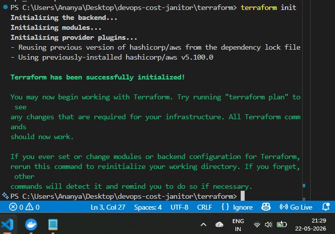
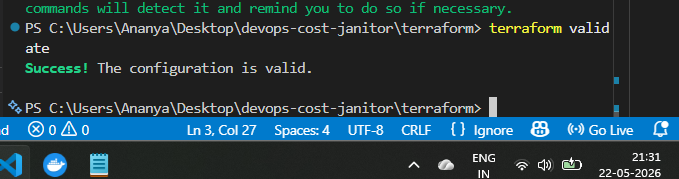
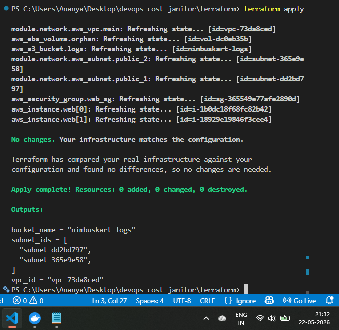
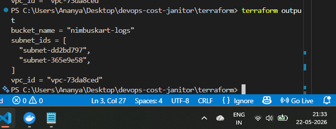

# DevOps Cost Janitor

A cloud automation and infrastructure provisioning project built using Terraform, AWS, Docker, and Python following modern DevOps and Infrastructure as Code (IaC) practices.

---

# Project Overview

The **DevOps Cost Janitor** project automates AWS infrastructure provisioning and demonstrates practical DevOps workflows including:

- Infrastructure as Code (IaC)
- Terraform automation
- AWS cloud resource provisioning
- Git & GitHub version control
- Cloud infrastructure management
- Terraform state handling
- Cost-aware resource deployment

The project provisions AWS resources such as:
- VPC
- Subnets
- S3 Bucket

---

# Tech Stack

## Cloud Platform
- AWS (Amazon Web Services)

## Infrastructure as Code
- Terraform

## Programming
- Python

## DevOps Tools
- Docker
- AWS CLI
- Terraform Local

## Version Control
- Git
- GitHub

---

# Project Structure

```bash
devops-cost-janitor/
│
├── terraform/
│   ├── main.tf
│   ├── variables.tf
│   ├── outputs.tf
│   ├── provider.tf
│   └── modules/
│
├── janitor/
│   └── report.md
│
├── screenshots/
│   ├── terraform-apply.png
│   ├── terraform-init.png
│   ├── terraform-output.png
│   └── terraform-validate.png
│
├── .gitignore
├── README.md
└── requirements.txt
```

---

# Features

- Automated AWS infrastructure provisioning
- Infrastructure management using Terraform
- VPC and subnet creation
- S3 bucket provisioning
- Modular Terraform configuration
- GitHub integration
- Clean repository management using `.gitignore`

---

# AWS Resources Created

The project successfully provisions:

- VPC
- Public Subnets
- S3 Bucket
- Networking Components

Terraform Outputs:

```bash
bucket_name = "nimbuskart-logs"

subnet_ids = [
  "subnet-dd2bd797",
  "subnet-365e9e58"
]

vpc_id = "vpc-73da8ced"
```

---

# Prerequisites

Install the following before running the project:

- Terraform
- Python 3.x
- AWS CLI
- Docker Desktop
- Git

---

# Installation & Setup

## 1. Configure AWS Credentials

```bash
aws configure
```

Enter:
- AWS Access Key
- AWS Secret Key
- Region
- Output Format

---

## 2. Install Python Dependencies

```bash
python -m pip install terraform-local boto3 rich click
```

---

## 3. Initialize Terraform

```bash
cd terraform
terraform init
```

---

## 4. Validate Terraform Configuration

```bash
terraform validate
```

---

## 5. Preview Infrastructure

```bash
terraform plan
```

---

## 6. Deploy Infrastructure

```bash
terraform apply
```

Type:

```bash
yes
```

---

# Terraform Outputs

Retrieve deployed resource details:

```bash
terraform output
```

---

# Destroy Infrastructure

To avoid AWS charges:

```bash
terraform destroy
```

---

# Screenshots

## Terraform Initialization



---

## Terraform Validation



---

## Terraform Apply



---

## Terraform Output



---

# Challenges Faced

During the implementation of this project, several real-world DevOps challenges were resolved:

- Terraform provider large file issue
- GitHub push rejection due to Terraform cache
- Git history cleanup
- AWS authentication setup
- Terraform state management
- Repository cleanup using `.gitignore`

These troubleshooting steps improved practical DevOps understanding and debugging skills.

---

# Learning Outcomes

This project helped in gaining hands-on experience with:

- Infrastructure as Code (IaC)
- Terraform workflows
- AWS cloud provisioning
- Git & GitHub operations
- Terraform state handling
- DevOps deployment lifecycle
- Infrastructure automation
- Cloud resource management

---

# Future Enhancements

- CI/CD Pipeline Integration
- CloudWatch Monitoring
- Lambda-based cleanup automation
- Cost optimization dashboard
- Automated scheduling
- Multi-cloud support

---

# Author

## Ananya Chaurasia

- GitHub: https://github.com/ananyagla
- Department: Computer Science Engineering
- GLA University, Mathura

---

# Conclusion

The DevOps Cost Janitor project successfully demonstrates cloud infrastructure automation using Terraform and AWS while following modern DevOps practices. The project highlights practical skills in infrastructure provisioning, cloud management, troubleshooting, and deployment workflows essential for DevOps and Cloud Engineering roles.